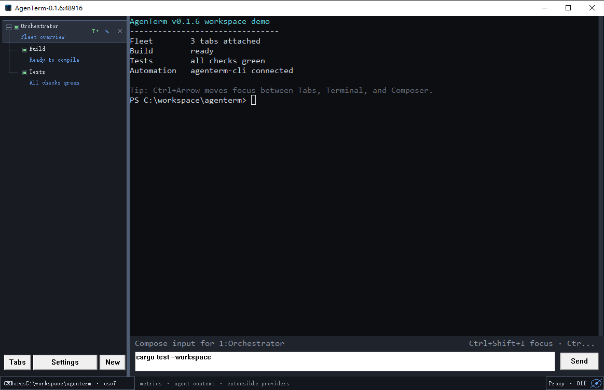

# AgenTerm

AgenTerm is a Rust-native terminal and local AI fleet controller for
**Windows, macOS, and Linux** (`x86_64` and `aarch64`). It combines
hierarchical tabs, per-tab composers and environments, a native automation
client, and a deliberately bounded tmux/RMUX frontend.



## Why AgenTerm

- **Lightweight native core** — Rust with platform-native rendering (Win32/GDI,
  winit). No Electron shell. Public releases enforce binary budgets: **4 MiB**
  for the GUI and Control Center, **2 MiB** each for CLI, mux, and MCP.
- **Stable fleet semantics** — Detach-first close keeps live PTYs running;
  exited processes stay readable until you explicitly close the tab; normal
  restarts restore the workspace tree, names, notes, and drafts.
- **Open and auditable** — Source on GitHub under **MIT OR Apache-2.0**. Read
  the code, run the gates, and inspect every release artifact yourself.
- **Supply-chain evidence** — Public releases ship SHA-256 checksums, SPDX SBOM,
  and provenance metadata. Unix installs verify checksums before extraction.
- **Local-first control plane** — IPC listens on loopback only
  (`127.0.0.0/8` / `::1`). The MCP sidecar is read-only stdio with no network
  listener in its first shipped slice.
- **Verifiable automation** — Structured snapshots, event positions,
  deterministic waits, and control receipts. Unsupported operations fail
  explicitly instead of returning false success.
- **Portable on six targets** — Windows, macOS, and Linux on `x86_64` and
  `aarch64`. Portable zip on Windows; one-line user-scope install on Unix.

## Current highlights

- Native Win32/GDI UI with hierarchical team tabs on the left.
- Compact, scrollable tree-first sidebar with two-line names/notes and a
  draggable width boundary.
- Terminal toolbar keeps `<Tabs`/`>Tabs` and `New` at the left while anchoring
  an isolated `Control Center` in the middle and `Settings` at the right.
- `agenterm-cc` is the replaceable Control Center projection for Cockpit,
  Workflows, Extensions, and InfoHub. Its offline snapshot reports unavailable
  providers truthfully; closing or crashing it does not own terminal state.
- Terminal-scoped bottom status surface is ready for metrics and agent context
  providers without consuming the full-height Tabs column.
- Branded Windows icon and a persistent terminal font/size settings panel.
- `cmd.exe` is the default shell.
- Two-line tabs separate program/terminal TITLE from a user-maintained note.
- Tabs can be nested as agent/program teams without coupling process lifetimes.
- Normal app restarts restore the tab tree, names, notes, drafts, commands, and
  active tab; PTY commands restart as new processes.
- Exited processes leave a `[dead]` tab until the user explicitly closes it.
- Every tab owns a composer text box and Send button.
- `New` opens a configuration surface for shell profile and initial command;
  retained HTTP(S) proxy drafts are temporarily inert pending a later design.
- Local CLI can create, select, rename, inspect, capture, and drive tabs.
- Mouse-wheel history, a draggable scrollbar, and highlighted terminal text
  selection share the same viewport; selected text copies to the Windows
  clipboard.
- Snapshot-positioned bounded event reads and waits expose explicit restart,
  gap, and timeout results.
- `agenterm-rh` / `agenterm-rh.exe` is the task and worker CLI for repository
  automation (`scripts/rh/*.rh`), observable Fleet tools, and versioned named
  tasks without linking the scripting engine into the GUI. Archived Rhai sources
  live under `scripts/archive/rhai/`; the former `agenterm-rhai` shim was
  removed in Phase C Wave 4.5.
- `agenterm-cli mcp` is the on-demand read-only MCP surface (no separate
  `agenterm-mcp` PE). Its first v0.1.10 slice serves four metadata-only Fleet
  resources and one bounded `agenterm_wait` tool over stdio; it exposes no
  mutation tool or network listener.
- `agenterm server` proves the headless
  workspace/PTY/parser/event authority required for replaceable GUI work.
- `new-agent` launches Codex in a named fleet tab with stable AgenTerm context.
- Tab-scoped environment and proxy values apply only to the child process and
  are not written to the persistent workspace.
- `agenterm-cli mux` provides the supported tmux/RMUX session/window surface
  (no separate `agenterm-mux` PE); unsupported operations fail explicitly.
- Whole-window and per-pane PNG screenshots support visual feedback testing.
- PTY process management uses `rmux-pty`.

## Install

### macOS & Linux

One line — no `sudo`, checksum-verified, commands linked into `~/.local/bin`:

```bash
curl -fsSL https://raw.githubusercontent.com/mgttt/agenterm/main/install.sh | bash
```

The installer resolves the latest GitHub Release, verifies SHA-256 before
extraction, keeps versioned payloads under `~/.local/share/agenterm`, and
starts the GUI when a graphical session is available. On macOS it also creates
`~/Applications/AgenTerm.app`.

Pin a version or install without launching:

```bash
curl -fsSL https://raw.githubusercontent.com/mgttt/agenterm/main/install.sh \
  | AGENTERM_VERSION=v0.1.14 AGENTERM_NO_LAUNCH=1 bash
```

### macOS developer preview

v0.1.14 ships macOS as a labeled **unsigned developer preview**. The
installer never selects it silently. Read the
[unsigned-preview security notes](docs/macos-unsigned-preview.md), then opt in:

```bash
curl -fsSL https://raw.githubusercontent.com/mgttt/agenterm/main/install.sh \
  | AGENTERM_ALLOW_UNSIGNED_PREVIEW=1 bash
```

### Windows

Download the portable zip for your CPU architecture from
[GitHub Releases](https://github.com/mgttt/agenterm/releases/latest), extract
it anywhere, and run `agenterm.exe`. All four client binaries plus build
metadata ship in the same folder — no installer and no admin rights required.

| Architecture | Asset |
|---|---|
| x86_64 | `agenterm-<version>-windows-x86_64.zip` |
| arm64 | `agenterm-<version>-windows-aarch64.zip` |

The installer exits without changing the active installation when the selected
release has no package for the current platform. List all installer overrides
with:

```bash
curl -fsSL https://raw.githubusercontent.com/mgttt/agenterm/main/install.sh \
  | bash -s -- --help
```

## Build and run

```powershell
cd D:\dev\agenterm
.\build.bat
.\dist\agenterm.exe
```

On macOS, build and install local binaries as a real application bundle:

```bash
./build.sh
./install.sh --local-build target/debug
open ~/Applications/AgenTerm.app
```

Pin `AgenTerm.app`, not `target/debug/agenterm`, in the Dock. Finder launches a
bare executable through Terminal, which produces a `Last login` shell window
before AgenTerm starts. The local installer copies the build into the
versioned user installation, refreshes `~/.local/bin`, and creates the stable
`~/Applications/AgenTerm.app` Dock entry. This explicit local path does not
weaken signature verification for downloaded Release packages.

The default build is **release-fast**: optimized PE staged into `dist/` (no
LTO, parallel codegen, incremental under `target/release-fast/`). Debug PE
stays in `target/debug/` (`cargo build` or `.\build.bat dev`). Use
`.\build.bat release` only for a distributable build; it applies the
size-focused profile in an isolated `target-release/` scratch directory,
stages the finished artifacts in `dist/`, and then clears only that scratch
cache while preserving the incremental development `target/`. All modes
produce four ignored executables plus
build metadata under `dist/`:

- `dist/agenterm.exe` — GUI application; `agenterm server` starts the headless
  authority as a separate process of the same PE.
- `dist/agenterm-cc.exe` — isolated Control Center projection; informational
  commands include `--help`, `--version`, `capabilities --json`, and
  `snapshot --json`.
- `dist/agenterm-cli.exe` — full native observation and automation client,
  including `mux` (tmux/RMUX) and `mcp` (stdio sidecar) subcommands.
- `dist/agenterm-rh` — native `.rh` task/worker CLI (live automation under
  `scripts/rh/`; archived Rhai under `scripts/archive/rhai/`).
- `dist/agenterm.json` — version, UTC build time, Git state, Rust target, size, and
  SHA-256 metadata.

Run the complete quality gate:

```powershell
.\check.cmd
```

Smoke tests inherit `AGENTERM_NO_ACTIVATE=1`, so their isolated GUI windows do
not interrupt the foreground application. `.\check.cmd --release` omits the
4,128-write event-journal load test; the clean GitHub release runner adds
`--include-stress`.

The machine-readable platform contract is available without starting a server:

```powershell
.\dist\agenterm-cli.exe protocol-info
```

Its `platform` block reports the native adapter, contract revision, and typed
Window/Input/IME/Clipboard/Font/Screenshot/Activation/Integration status.
Missing behavior is reported as `unsupported` or `failed`, never silently
relabeled as available.

### Linux GUI

Native Linux `agenterm` and `agenterm-cc` use winit. Control clients
(`agenterm-cli`, `agenterm-rh`) do not need display libraries.

**Release tarballs** ship a small `lib/` directory plus `agenterm` and
`agenterm-cc` launchers that set `LD_LIBRARY_PATH` before starting their hidden
native binaries, so end users do not need
`sudo apt install` for X11/Wayland keyboard libraries.

**Building from source** on a minimal host still needs the same libraries available
to the linker/runtime (CI installs them automatically):

```bash
sudo apt-get install -y \
  libxkbcommon0 libxkbcommon-x11-0 libwayland-client0 \
  libx11-6 libxcb1 libxcb-xkb1
./scripts/build-linux-clients.sh
DISPLAY=:1 ./target/x86_64-unknown-linux-gnu/debug/agenterm
```

The Unix GUI rasterizes a platform system monospace font with anti-aliasing and
uses a system CJK fallback when available; the built-in `bitmap-8x8` remains a
startup-safe fallback. `terminal.font-size` is a logical point size that scales
both glyphs and grid density, while Retina backing pixels are handled separately.
On HiDPI displays the terminal content layer is rasterized again at the native
framebuffer resolution instead of enlarging 1× glyph pixels.
The configured `terminal.font-family` remains stored for Windows parity; the Unix
Settings panel reports the resolved system renderer as read-only. New macOS
profiles default to 14 pt; other platforms retain the 12 pt default.
macOS and Linux input-method events are enabled explicitly: composed Unicode
text is committed only after candidate selection, with visible preedit feedback
anchored to the active terminal or editor field.
The Unix renderer also honors DECSCUSR cursor shape and blink requests for
block, underline, and bar cursors, including steady variants.
Terminal colors preserve theme-aware defaults, all 256 indexed xterm colors,
and 24-bit SGR foreground/background values.
SGR bold, dim, italic, and underline attributes remain compact in the terminal
grid and render consistently with Unicode sequences and truecolor output.

## Examples

```powershell
$r = ".\dist\agenterm-cli.exe"

& $r new-window -d -n build
& $r set-composer -t build "cargo check"
& $r send-composer -t build
& $r wait-pane -t build --contains "Finished" --timeout-ms 30000
& $r capture-pane -p -t build
& $r scroll-pane -t build page-up
& $r screenshot-pane -t build -o build.png

# Discover and run the bounded scripting surface.
& $r script api --json
& $r script eval "40 + 2"
& $r script eval "fleet.ui.snapshot().event_position.sequence" --profile observe

# Discover every registered server, then target one explicitly.
& $r server-list
& $r --address 127.0.0.1:48915 ui-snapshot

# Proxy flags are temporarily inert; configure proxy variables in the shell.
& $r new-agent -n reviewer -- --full-auto

# Explicit opt-in convenience for Codex's unsafe bypass mode; omitted by default.
& $r new-agent -n scratch --yolo

# Inspect the honest mux compatibility matrix.
.\dist\agenterm-cli.exe mux compatibility --json
```

IPC listens and connects only on numeric loopback addresses (`127.0.0.0/8` or
`::1`), including explicit `agenterm-cli mux --address` overrides.

## Release

Keep `Cargo.toml`'s version current, commit the release state on `main`, then
run the local validation/rehearsal:

```powershell
.\lint.cmd
.\release.cmd --rehearse
```

Public delivery is an exact-SHA two-stage GitHub Actions flow:

1. `Release Candidate` qualifies one explicit commit once and seals all six
   platform archives, hashes, SBOM, provenance, and the Windows qualification
   receipt into an immutable Candidate artifact.
2. After explicit release approval, `Release` verifies and promotes those same
   bytes without rebuilding, retesting, repackaging, or overwriting an existing
   tag/Release.

`release.cmd` is validation/rehearsal only and intentionally refuses local
publication. Candidate dispatch may be automated by an authenticated GitHub
Actions client; public Promotion remains a separate human approval boundary.
Git/GCM authentication used by `git push` is not GitHub Actions API
authentication.

## Documentation

- [Product tree and requirements](PRD.md)
- [Coding-agent guide](AGENTS.md)
- [Build and install a local macOS app](docs/macos-local-build.md)
