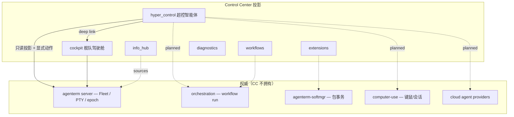

# Control Center — 超控智能体（Hyper-Control Agent）产品设计

| 字段 | 值 |
|------|-----|
| **文档** | CC 首 Tab「超控智能体」功能与布局设计 |
| **作者** | 产品设计（L-CC 子流） |
| **日期** | 2026-08-06 |
| **状态** | 设计稿 rev1 |
| **目标版本** | L-CC · v0.2.0+（可视化/布局先行；数据契约分阶段落地） |
| **SSOT 起点** | `prd/PRD_02_21_control_center.md`、`plan/plan-control-center-ux.md`、`plan/design-control-center-ux.md`、`plan/plan-cc-automation-cli.md`、`research/agenterm-webview/assets/` |
| **关联 view ID** | 新增 `hyper_control`；保留 `cockpit` · `workflows` · `extensions` · `info_hub` · `diagnostics`（chrome） |
| **LLM 供给** | `plan/design-llm-bridge-web-to-api.md`（免费 Web 会话桥 + BYOK；统一 OpenAI 兼容 loopback） |

> **命名澄清：** UI 占位文案可能仍写「超级智能体」，产品概念是 **超控智能体**（Hyper-Control Agent / Meta-Agent）——人类可读的**元控制层**，用于编排与监督智能体、资源、远程会话与工作流，**不是**单个「更强的大模型」或第二 Fleet 权威。

---

## 1. Executive Summary（执行摘要）

### 1.1 超控智能体是什么

**超控智能体**是 Control Center（`agenterm-cc`）的**默认首屏**：人类操作员对「整支自动化舰队」下达意图、观察状态、批准高风险动作的**元控制面（meta-layer）**。

它统一投影（只读 + 显式动作入口）四类对象：

| 平面 | 含义 | 权威归属 |
|------|------|----------|
| **Agent 舰队** | 本地 Fleet、Script worker、云 Agent（Cursor Cloud 等）、未来 MCP 编排侧车 | Fleet 事实 → `agenterm server`；云/外部 Agent → 各 provider 契约 |
| **资源平面** | computer-use 会话、进程/内存摘要、硬件/peripheral 占用 | computer-use 模块（L-CU，尚未入 PRD）；CC 仅投影 |
| **Server / Session 平面** | RDP、VNC、SSH 等远程会话清单与连接态 | 协议栈 / session 模块；CC 不持有会话密钥 |
| **Workflow / Pipeline** | 定义、运行、设计器、监控 | orchestration 模块；CC 编辑/投影，不执行 |

### 1.2 与「超级智能体」的区别

| 维度 | 误读：「超级智能体」 | 正解：「超控智能体」 |
|------|----------------------|----------------------|
| 隐喻 | 一个更聪明的 Agent | 人类的**超控台**（supervisory control） |
| 权威 | 像在 CC 里再跑一个「主脑」 | **不**成为第二 Fleet 权威；只编排与监督 |
| 数据 | 可伪造仪表盘、假 Agent 列表 | **诚实空状态** + 原因码；无契约则无数据 |
| 动作 | 静默代操、隐式安装 | **显式批准门**；安装/破坏性动作走 softmgr / server 契约 |
| 范围 | 只管本地 tab | 本地 + 远程 + 云 + 工作流**入口**（分阶段可用） |

### 1.3 与现有 Cockpit 的关系

- **`cockpit`**（view ID 不变）：**终端舰队驾驶舱**——server 身份、epoch、PTY tab 列表、`inspect`/`select`。**保留为独立顶层 Tab**，专注「我管的是哪支终端舰队、哪个 tab」。
- **`hyper_control`**（新增）：**跨域元控制**——Agent roster、资源/会话/workflow **总览与意图入口**。Cockpit 的 Fleet 摘要可在超控屏作**只读摘要卡片** deep-link 到 Cockpit，但不合并 view ID。

### 1.4 设计原则（硬约束复述）

1. CC 是可替换二级表面；崩溃/升级不影响 PTY 与 server。
2. 发布版 `agenterm-cc` **4 MiB** 预算；**禁止** Tauri/WRY 链入 shipping 二进制。
3. WebView 研究仅存在于 `research/agenterm-webview/`；vanilla JS/CSS，无 React/Vue/build step。
4. Native renderer 为稳定主路径；WebView 为 Phase C 可选。
5. 所有可见事实来自版本化公共契约；未交付能力显示 `unavailable` + 原因码。

---

## 2. User Problems & Outcomes（用户问题与成功证据）

### 2.1 主要用户

| 角色 | 典型场景 |
|------|----------|
| **人类操作员（主控）** | 同时监督本地终端 Fleet、若干云 Agent、远程桌面/SSH；需要一眼看清「谁在跑、谁卡住、该批准什么」 |
| **自动化 / 测试** | 通过 `agenterm-cli cc *` 打开 CC → 断言 `hyper_control` 布局与空状态；截图 + snapshot 双证据 |
| **未来 Agent harness** | 读取 CC 投影与显式批准门，**不**把 CC 当作权限策略引擎 |

### 2.2 用户问题 → 设计回应

| 问题 | 超控智能体回应 |
|------|----------------|
| 我有哪些 Agent 在跑？本地和云能不能放一张 roster？ | **Agent fleet roster** 分区；分 source 分组；无契约则分区级空状态 |
| 谁在用键鼠/远程桌面？会不会冲突？ | **Resource plane** + **Session plane**；computer-use 会话显式列出；冲突显示 `reason` 而非隐藏 |
| 工作流/pipeline 在哪设计、在哪看 run？ | **Workflow monitor** 入口；未交付则诚实 `workflow_runtime_unavailable` |
| 我想用一句话下指令，而不是点十个 tab | **Intent bar / command palette**；Phase A 仅本地草稿 + 复制到 CLI；Phase B+ 接 orchestration |
| server 重启后 UI 还显示旧数据？ | **Epoch / recovery** 视觉语言；stale 数据灰显或清空，禁止冒充 live |

### 2.3 可观察成功证据

| 阶段 | 证据 |
|------|------|
| Phase 0 | `selected_view=hyper_control` 可在 snapshot 中选中；PNG 显示首 Tab 布局与空状态文案 |
| Phase A | Native 五区线框 + 左侧 nav 首项；`cc-action select-nav --name hyper_control` 可自动化 |
| Phase B | Agent roster 显示 server 侧已知 worker/tab 投影；computer-use 显示 `planned` |
| Phase C | WebView 同构 HTML 壳 + bridge v1 只读 `fleet.snapshot`；WASM 拓扑可选 |

---

## 3. Information Architecture（信息架构）

### 3.1 与现有资产的对照

| 来源 | 当前结构 | 本设计处置 |
|------|----------|------------|
| PRD / `capabilities --json` | `cockpit` · `workflows` · `extensions` · `info_hub` | **新增** `hyper_control`；其余 **保留** |
| `design-control-center-ux.md` | 左垂直 nav：Cockpit 为首项 | **超控智能体升为首项**；Cockpit 降为第二项 |
| WebView stub `index.html` | 顶部分段 Tab：超级智能体 / InfoHub / 超级控制 | 研究壳 **重命名** Tab1 为「超控智能体」；Tab3「超级控制」**不**作为产品 view ID——内容并入 native **Cockpit + Diagnostics** |
| `plan-v0.1.15` 真机 | 可选 `agenterm-cc-web` 三 Tab 占位 | 仍仅 research；产品 native 路径 SSOT 为本文件 + `design-control-center-ux.md` |

### 3.2 推荐顶层 Tab 树（定稿建议）

**决策：新增顶层 view `hyper_control`，作为默认 `selected_view`；不 rename `cockpit`。**

```text
Control Center（agenterm-cc）
├─ Chrome（始终）
│  ├─ top_bar：标题 · context 标签 · connection badge · overflow
│  ├─ left_nav：主视图（Phase A 指针可选；见 design-control-center-ux KD-15）
│  └─ status_bar：renderer · epoch · sequence · 短诊断
│
├─ hyper_control          ← Tab 1 · 超控智能体 【新增 · 默认首屏】
├─ cockpit                ← Tab 2 · Cockpit（终端舰队）
├─ workflows              ← Tab 3 · Workflows
├─ extensions             ← Tab 4 · Extensions
├─ info_hub               ← Tab 5 · InfoHub
└─ diagnostics            ← Chrome nav · 诊断（不进 capabilities views[] 直至版本化）
```

**中文标签（产品面）**

| view ID | 英文（snapshot/CLI） | 中文 UI 标签 |
|---------|----------------------|--------------|
| `hyper_control` | Hyper-Control Agent | **超控智能体** |
| `cockpit` | Cockpit | 舰队驾驶舱（或保留 Cockpit） |
| `workflows` | Workflows | 工作流 |
| `extensions` | Extensions | 扩展 |
| `info_hub` | InfoHub | 信息中心 |
| `diagnostics` | Diagnostics | 诊断 |

**理由摘要**

1. **Stable API**：已有 smoke、CLI、`inspect` 绑定 `cockpit`；改名成本高于新增首 Tab。
2. **语义分离**：Cockpit = PTY/tab 权威投影；超控 = 跨 Agent/资源/会话/workflow 的**元层**，避免一个 view 承担两种心智模型。
3. **WebView 对齐**：研究壳三 Tab 映射为 `hyper_control` + `info_hub` +（运营态 → native Cockpit/Diagnostics，**不**新增 `super_control` view ID）。
4. **主工具栏入口**：`open-control-center` 打开 CC 时默认 `hyper_control`，符合 mailbox「超级智能体 + Hub」远景且修正命名。

### 3.3 IA 关系图



### 3.4 WebView 研究壳 Tab 映射（Phase C）

| WebView Tab（HTML `data-tab`） | 产品 view ID | 说明 |
|--------------------------------|--------------|------|
| `agent` → 超控智能体 | `hyper_control` | 全屏五区布局 HTML 原型 |
| `hub` | `info_hub` | InfoHub + 未来 PluginHub/AppHub 入口链接 |
| `control` | *(无独立 view ID)* | 原型中的 server/recovery 控件 → native **Cockpit 顶栏 + Diagnostics** |

---

## 4. Tab 1 深度设计：超控智能体

### 4.1 布局总览（760×480 逻辑画布，内容区可纵向虚拟滚动）

```text
┌─ top_bar ───────────────────────────────────────────────────────────────┐
│ AgenTerm Control Center    ctx:user_main · dev@…        ● Connected   [···]│
├─nav───┬─ hyper_control 内容区 ────────────────────────────────────────────┤
│●超控  │ ┌─ Intent bar ─────────────────────────────────────────────────┐ │
│ ○驾驶 │ │ ⌘ 输入意图或命令…          [执行] [批准队列 0]   palette ⌘K   │ │
│ ○工作 │ └──────────────────────────────────────────────────────────────┘ │
│ ○扩展 │ ┌─ Agent roster ─────────────┬─ Resource plane ─────────────────┐ │
│ ○信息 │ │ LOCAL FLEET                │ COMPUTE-USE                      │ │
│ ───── │ │  server dev · 8 tabs       │  (unavailable)                   │ │
│ ○诊断 │ │  script workers · —        │  reason: computer_use_unavailable│ │
│       │ │ CLOUD AGENTS               │ PROCESS / MEMORY                 │ │
│       │ │  (unavailable)             │  server PID · epoch 3 · —        │ │
│       │ │  reason: cloud_agent_…     │ HARDWARE                         │ │
│       │ └────────────────────────────┴──────────────────────────────────┘ │
│       │ ┌─ Session plane ────────────┬─ Workflow / Pipeline ──────────────┐ │
│       │ │ SSH / RDP / VNC           │ DEFINITIONS · RUNS · DESIGNER      │ │
│       │ │  (unavailable)            │  (unavailable)                     │ │
│       │ │  reason: session_plane_…  │  reason: workflow_runtime_unavail. │ │
│       │ └───────────────────────────┴────────────────────────────────────┘ │
├───────┴────────────────────────────────────────────────────────────────────┤
│ status: connected · renderer=native · epoch=3 · seq=1842 · view=hyper_control│
└────────────────────────────────────────────────────────────────────────────┘
```

**Zone 优先级（窄窗 / Phase A）**

1. Intent bar（单行，固定）
2. Agent roster + Resource plane（上排两列；≤640px 宽时 **堆叠为上下**
3. Session plane + Workflow monitor（下排两列）
4. 各分区独立滚动；整页 virtual-scroll（native-A 合成行模型，见 `design-control-center-ux.md`）

### 4.2 Zone A — Intent bar / Command palette（意图条）

**用户问题：** 我想用自然语言或短命令表达「下一步」，而不是在多个 Hub 间跳转。

```text
┌─ Intent bar ─────────────────────────────────────────────────────────────┐
│ > _                                                                      │
│ placeholder: 「监督 build Agent，批准安装前问我」                          │
│ [Submit intent]  [Open palette ⌘K]  [Approval queue (0)]                 │
└──────────────────────────────────────────────────────────────────────────┘
```

| 元素 | Phase A | Phase B+ |
|------|---------|----------|
| 文本输入 | 本地 **draft only**；不落盘为 workflow | 提交到 orchestration「intent」契约（若存在） |
| Palette | 静态命令列表：跳转 Cockpit、复制 endpoint、`agenterm-cli` 片段 | 可搜索动作 registry |
| **Model 选择** | Phase A：`unavailable` + `llm_gateway_unavailable` | Phase B：`Model:` 下拉；状态见 `design-llm-bridge-web-to-api.md` |
| Approval queue | 空状态；显示「无待批准项」 | 列出 server/orchestration 返回的 pending approvals |
| 快捷键 | Host 仅 `ControlCenterKey` 子集；palette **Phase A 无全局 ⌘K**（标注 planned） | 平台 chord PR 之后启用 |

**禁止：** 在 CC 内执行任意 Script、静默 Fleet 变更、或绕过 server receipt 的「一键执行」。

### 4.3 Zone B — Agent fleet roster（智能体舰队名册）

**分组（始终显示分组标题；无数据则组内空行 + 原因码）**

```text
┌─ Agent fleet roster ─────────────────────────────────────────────────────┐
│ LOCAL FLEET · source: agenterm server                                    │
│ ┌──────────────────────────────────────────────────────────────────────┐ │
│ │ ● dev · epoch 3 · 12 tabs · 8 running · 4 dead          [→ Cockpit]│ │
│ │ ○ script-runtime · — workers · reason: script_catalog_only         │ │
│ └──────────────────────────────────────────────────────────────────────┘ │
│ CLOUD AGENTS · source: (none)                                            │
│ ┌──────────────────────────────────────────────────────────────────────┐ │
│ │ ◇ No cloud agent registry on this server.                            │ │
│ │   reason: cloud_agent_registry_unavailable                           │ │
│ │   Connect a provider or open Diagnostics.                            │ │
│ └──────────────────────────────────────────────────────────────────────┘ │
│ REMOTE FLEET ATTACH · source: (none)                                     │
│   reason: remote_fleet_attach_unavailable                                │
└──────────────────────────────────────────────────────────────────────────┘
```

| 行字段（有数据时） | 来源 |
|--------------------|------|
| 名称 / instance | server snapshot `logical_instance` |
| epoch / sequence | `connected_server` |
| tab 计数 | 已有 Cockpit 字段 |
| worker 行 | Script catalog / task worker 契约（planned） |
| 云 Agent | Cursor Cloud / MCP 侧车 registry（planned） |

**交互：** 选中 LOCAL FLEET 行 → 高亮；Primary action **「在驾驶舱中打开」** → `select-nav cockpit`（语义动作，非第二权威）。

### 4.4 Zone C — Resource plane（资源平面）

```text
┌─ Resource plane ─────────────────────────────────────────────────────────┐
│ COMPUTE-USE SESSIONS                                                     │
│   ◇ Computer-use is not available.                                       │
│   reason: computer_use_unavailable                                       │
│   Planned: local mouse/keyboard sessions with explicit lease.            │
├──────────────────────────────────────────────────────────────────────────┤
│ PROCESS / MEMORY (read-only summary)                                     │
│   server PID 12345 · uptime — · CC projection worker ✓                   │
│   PTY count: 8 running / 4 dead (from server snapshot)                   │
├──────────────────────────────────────────────────────────────────────────┤
│ HARDWARE / PERIPHERALS                                                   │
│   ◇ Hardware inventory unavailable.                                      │
│   reason: hardware_inventory_unavailable                                 │
└──────────────────────────────────────────────────────────────────────────┘
```

**Phase B 有数据时：** compute-use 会话行显示 `session_id`、owner Agent、lease 状态、`[Revoke]`（显式、需确认）。

**权威：** computer-use 模块（L-CU）；CC 仅展示 + 转发 typed action 到未来公共 API。

### 4.5 Zone D — Server / Session plane（远程会话平面）

```text
┌─ Session plane ──────────────────────────────────────────────────────────┐
│ SSH · RDP · VNC · local attach                                           │
│   ◇ Session inventory is not connected.                                  │
│   reason: session_plane_unavailable                                      │
│   Planned: current · ssh · rdp · vnc tiers (see plan-v0.1.15 §5.6 L-CU). │
│                                                                          │
│ [+ New session…]  (disabled until contract ships)                        │
└──────────────────────────────────────────────────────────────────────────┘
```

| 协议 | 列（planned） | 备注 |
|------|---------------|------|
| `current` | 本机 desktop/session | L-CU 最急 |
| `ssh` | host · user · state | 不显示密钥 |
| `rdp` | host · resolution · state | |
| `vnc` | host · display · state | |

**空状态必须诚实：** 不得展示假 SSH/RDP 行或「已连接」绿点。

### 4.6 Zone E — Workflow / Pipeline designer & monitor

```text
┌─ Workflow / Pipeline ────────────────────────────────────────────────────┐
│ DEFINITIONS          RUNS              DESIGNER                            │
│   (unavailable)        (unavailable)     (unavailable)                     │
│   workflow_runtime_unavailable                                           │
│                                                                          │
│ ◇ Orchestration module has not published workflow APIs to this server.   │
│   [Learn: Workflows tab →]  (nav link only)                              │
└──────────────────────────────────────────────────────────────────────────┘
```

**有数据后（Phase B+）：** 迷你 run 时间线（只读）+ 「在 Workflows 中打开」链接；Designer 区域显示 `planned` 直至图编辑器契约就绪。

**禁止：** 用 Rhai task 列表伪装 durable workflow run。

### 4.7 完整首屏线框（Phase A native 文本近似）

```text
┌──────────────────────────────────────────────────────────────────────────┐
│ AgenTerm Control Center — 超控智能体 · user_main · 12 tabs               │
├──────────┬───────────────────────────────────────────────────────────────┤
│● 超控智能体│ Intent: [_ type directive…________________] [Queue 0]       │
│○ 舰队驾驶舱│ ─────────────────────────────────────────────────────────── │
│○ 工作流   │ AGENT ROSTER                                                 │
│○ 扩展     │  LOCAL  dev · ep … · 8 run / 4 dead · epoch 3   [Cockpit→] │
│○ 信息中心 │  CLOUD  (empty) cloud_agent_registry_unavailable             │
│──────────│  REMOTE (empty) remote_fleet_attach_unavailable               │
│○ 诊断     │ RESOURCES                                                    │
│          │  CU    computer_use_unavailable                               │
│          │  PROC  server PID … · tabs 12                                 │
│          │  HW    hardware_inventory_unavailable                         │
│          │ SESSIONS  session_plane_unavailable                            │
│          │ WORKFLOW  workflow_runtime_unavailable → see Workflows tab    │
├──────────┴───────────────────────────────────────────────────────────────┤
│ connected · native · epoch 3 · seq 1842                                  │
└──────────────────────────────────────────────────────────────────────────┘
```

---

## 5. Interaction Model（交互模型）

### 5.1 选择、焦点与导航

| 概念 | 规则 |
|------|------|
| **Global selection** | 至多一个「主选中对象」（roster 行 / session 行 / run 行） |
| **View focus** | `selected_view` 由 left nav 改变；snapshot 发布 `selected_view=hyper_control` |
| **Zone focus** | Phase A：Tab 顺序 roster → resources → sessions → workflow（键盘 ↑↓ 在 zone 内）；Web Phase C：标准 roving tabindex |
| **Deep link** | roster「→ Cockpit」= `select-nav cockpit` + 可选 scroll-to-tab |
| **Draft 与 live** | Intent bar 草稿为 **CC 本地状态**；不冒充已提交 orchestration |

### 5.2 批准门（Approval gates）

```text
Human intent → [Draft] → (optional) Submit → Pending approval → Explicit confirm → Server/orchestration receipt
```

| 风险级 | UI | 后端 |
|--------|-----|------|
| 低（导航、inspect） | 即时 | 已有 server ops |
| 中（select tab、focus CC） | 即时 + receipt | server |
| 高（install、revoke CU lease、kill remote session） | **Modal / queue** + 原因说明 | softmgr / CU / session 模块 |
| 禁止 | 无「记住不再询问」静默 destructive | — |

超控屏 **Approval queue** 徽章显示 pending 数量；点击展开列表（Phase B+）。

### 5.3 Epoch / Recovery 视觉语言

与 `design-control-center-ux.md` §4.2 对齐，**超控屏额外规则：**

| 状态 | 超控屏行为 |
|------|------------|
| `connected` | 各 zone 正常；roster 显示 live 计数 |
| `server_unreachable` | 顶栏 `! Offline`；roster 保留 **stale** 快照须标 `observed_at` + 灰显；禁止新 submit |
| Recovering | 顶栏 `◐ Recovering`；zone 内 「Waiting for baseline…」 |
| Epoch changed | _pulse 徽章「Epoch 4」_；清空 pre-epoch 的 Agent/run 缓存 |
| `server_incompatible` | 阻断 Intent submit 与 deep action；引导 Diagnostics |
| `projection_worker_unavailable` | 显示本地 worker 错误；注明 PTY 不受影响 |

**Glyph 建议（native mono / Web token 共用）**

| Glyph | 含义 |
|-------|------|
| `●` | live / running |
| `○` | idle / disconnected |
| `◇` | empty / unavailable honest shell |
| `!` | error / offline |
| `◐` | recovering |
| `⊗` | incompatible |

---

## 6. Empty / Degraded / Unavailable States（空状态与降级）

### 6.1 分区级模板

```text
◇ {Zone title}
  {One sentence: what would appear here when available.}
  reason: {monospace_reason_code}
  {Optional guidance line with → link target view or CLI command.}
```

### 6.2 原因码表（超控智能体专用 + 复用）

| reason code | 分区 | 中文摘要 | 指导文案 |
|-------------|------|----------|----------|
| `no_server_context` | 全局 | 未连接 Fleet 权威 | 从终端或 CLI 指定 `--instance` / endpoint |
| `server_unreachable` | 全局 | Server 不可达 | 等待恢复或检查 server 进程 |
| `server_incompatible` | 全局 | 协议/版本不兼容 | 打开 Diagnostics；对齐 server 与 cc 版本 |
| `projection_worker_unavailable` | 全局 | CC 投影 worker 失败 | 重启 CC；PTY 不受影响 |
| `cloud_agent_registry_unavailable` | Agent roster · CLOUD | 无云 Agent 注册表 | planned · 连接 MCP/cloud provider |
| `remote_fleet_attach_unavailable` | Agent roster · REMOTE | 无远程舰队挂载 | planned |
| `script_worker_summary_unavailable` | Agent roster · script | Script worker 摘要未接入 | 使用 `agenterm-rhai` CLI |
| `computer_use_unavailable` | Resource · CU | computer-use 未交付 | 见 plan-v0.1.15 L-CU |
| `hardware_inventory_unavailable` | Resource · HW | 硬件清单未接入 | planned |
| `session_plane_unavailable` | Session | SSH/RDP/VNC 平面未接入 | planned · L-CU |
| `workflow_runtime_unavailable` | Workflow | 工作流运行时不可用 | 切换到 Workflows tab 查看详情 |
| `orchestration_intent_unavailable` | Intent bar | 意图提交 API 未交付 | 本地草稿仅；复制到 CLI |
| `llm_gateway_unavailable` | Intent bar · Model | LLM 网关 sidecar 未运行 | 链 `design-llm-bridge-web-to-api.md` 设置 |
| `llm_no_provider_configured` | Intent bar · Model | 无 BYOK 且无 Web 登录 | 引导 Provider settings |
| `provider_session_expired` | Model / Provider 卡片 | Web 会话过期 | **[Re-login]** |

### 6.3 降级态（有 partial 数据）

| 场景 | 显示 |
|------|------|
| 仅 server 连接，无 CU/session/cloud | LOCAL FLEET 有数据；其余 zone `◇` + reason |
| Stale snapshot | 行尾 `· stale @ {iso8601}`；Intent submit disabled |
| 单组件失败 | 分区级 error；不拖垮整页 |

---

## 7. Native vs WebView Rendering Strategy（渲染策略）

### 7.1 分区映射表

| UI 分区 | Phase A native | Phase C WebView |
|---------|----------------|-----------------|
| Chrome（nav/top/status） | 合成 monospaced 行（KD-18） | HTML `<header>` + `<nav class="left-rail">` |
| Intent bar | 1–2 固定文本行 + `[ ]` 假输入 | `<input>` + palette overlay |
| Agent roster | 文本表格 | `<section id="zone-roster">` 列表组件 |
| Resource / Session | 文本段落 + reason | 卡片 grid |
| Workflow monitor | unavailable 壳 | 同左 + 未来 mini timeline canvas |
| Topology graph | **不实现** | WASM graph（Phase C+） |
| 交互 hit-test | `nav_lines` / zone line indices | DOM `data-target-id` + `cc-action --target` |

### 7.2 Phase A native 文本近似原则

- 不假装有图形卡片：用 `───` 分隔线与列对齐。
- 每 zone **最多 N 行**（防 760×480 溢出）：超出进 virtual scroll。
- `[Cockpit→]`、`[Queue 0]` 为 **published hit-target**（对齐 `plan-cc-automation-cli.md`）。
- 颜色：Phase A 可 mono；badge 用 glyph 前缀（`!`、`◐`）。

### 7.3 Phase C WebView 原则

- 同一 `selected_view=hyper_control`；bridge v1 仅 `host.ready` / `host.facts` / `fleet.snapshot`（只读）。
- JS **不得**成为第二权威；无 `fetch` 外网（CSP `connect-src 'none'`）。
- 布局 CSS 与 native zone 边界 **同名**（便于 snapshot 对照）。

---

## 8. Web Tech Stack（Phase C 研究壳）

### 8.1 文件布局（`research/agenterm-webview/assets/`）

```text
assets/
├── index.html              # 壳：chrome + nav + panel 挂载点
├── app.css                 # 全局 token + layout
├── app.js                  # Tab 切换、空状态、无 bridge
├── hyper-control/
│   ├── panel.html          # 可选：fetch 片段或 inline section
│   ├── hyper-control.css   # 五区 grid
│   └── hyper-control.js    # zone 渲染、reason 映射
├── shared/
│   ├── tokens.css          # --accent, --muted, epoch colors
│   ├── empty-state.js      # ◇ 模板 + reason 表
│   └── nav.js              # left rail ↔ view id 映射
└── wasm/                   # Phase C+ 占位
    └── README.md           # 加载策略说明；二进制 gitignore
```

### 8.2 技术选型

| 项 | 选择 |
|----|------|
| 框架 | **无**；vanilla ES modules 或 IIFE（与现 `app.js` 一致） |
| 构建 | **无**；`include_bytes!` 打包 |
| CSS | 原生变量 + grid/flex；与 cockpit 暗色密度对齐 |
| 国际化 | `lang=zh-Hans` 产品文案；view ID 保持英文 |

### 8.3 性能与体积

- 首屏 HTML+CSS+JS **< 200 KiB** gzip 目标（为 4 MiB 发布版留预算给 Rust；research host 不限但应自律）。
- 无第三方 CDN；字体用 system-ui。
- Tab 切换仅 toggle `hidden` / class，不 reload document。
- WASM 懒加载：`import()` 或 `<script type="module">` 动态注入，失败显示 `wasm_module_unavailable`。

### 8.4 CSP（与 research README 一致）

```text
default-src 'none';
script-src 'self';
style-src 'self' 'unsafe-inline';
img-src 'self' data:;
connect-src 'none';
frame-src 'none';
```

### 8.5 Bridge 数据绑定（Phase C，只读）

| DOM 区域 | bridge 方法 | 字段 |
|----------|---------------|------|
| LOCAL FLEET 行 | `fleet.snapshot` | tab counts, epoch, instance |
| Connection badge | `host.facts` | `server_state`, `server_reason` |
| 其余 zone | — | 保持客户端 reason 表直至专用契约 |

---

## 9. WASM Roadmap（WASM 路线图）

| 用途 | 模块 | 灵感来源 | 说明 |
|------|------|----------|------|
| Agent/Fleet **拓扑图** | `hyper-control-graph.wasm` | [copy.sh](https://copy.sh/) 的轻量 viz 思路 | 节点=Agent/session/tab；边=delegate/attach；**只读**布局 |
| **Mini terminal 预览** | `term-preview.wasm` | xterm.js 思路但 **不引入** xterm 体积 | 单行或缩略 ANSI 视图；数据来自 server snapshot 片段 |
| **Sandbox pane** | `v86-style.wasm` | [v86](https://github.com/copy/v86) 的 in-browser emu 模式 | 隔离演示/培训用 VM 窗格；**非**默认路径；需显式启用 |
| 图布局算法 | 小型 Rust→wasm | — | 避免 JS 重布局卡顿 |

**原则：** 灵感借鉴架构模式，**不**拷贝 copy.sh/v86 代码入仓；WASM 模块 optional，缺失时回退文本 roster。

**加载边界：** WASM 在 WebView 内运行；**无**直接 Fleet 写权限；读写经 bridge v1 请求/响应。

---

## 10. Authority Boundaries Table（权威边界）

| 数据/动作 | 权威模块 | CC 超控屏角色 | 禁止 |
|-----------|----------|---------------|------|
| PTY / tab 树 / epoch / sequence | `agenterm server` | 只读投影；跳转 Cockpit 执行 select | 本地编造 tab |
| Tab select / inspect | `agenterm server` | 转发 typed op + receipt | 无 receipt 改 active tab |
| Workflow 定义 / run | orchestration | 投影 + 未来编辑入口 | Rhai task 冒充 run |
| 包安装/更新 | `agenterm-softmgr` | 仅「请求安装」按钮 | 静默安装 |
| computer-use lease | L-CU（planned） | 会话列表 + revoke 请求 | CC 内嵌权限策略 |
| SSH/RDP/VNC 会话 | session/L-CU（planned） | 清单 + connect 请求 | 存储凭据 |
| 云 Agent 列表 | provider / MCP | 聚合展示 | 伪造 cloud agent |
| Intent / approval | orchestration（planned） | 草稿 + queue UI | 自动批准 destructive |
| Script 执行 | `agenterm-rhai` | 链接/CLI 提示 | Script profile 当权限 |
| CC 导航/草稿 | CC 进程 | 拥有 | — |
| PNG / 键鼠自动化 | CC owner | `cc-screenshot` / `cc-action` | 全局 SendInput |

---

## 11. Phased Delivery（分阶段交付）

```text
Phase 0 — 占位（当前 → v0.2.0 设计落地）
├─ view ID `hyper_control` 登记于 capabilities（可 unavailable）
├─ left nav 首项标签「超控智能体」
├─ 全屏 honest empty shell（五区 reason 码）
└─ WebView stub Tab 文案改为「超控智能体」

Phase A — Native chrome（与 design-control-center-ux PR-2 对齐）
├─ nav 可切换 hyper_control / cockpit / …
├─ 五区 ASCII 布局 + virtual scroll
├─ LOCAL FLEET 摘要来自已有 server snapshot（连接时）
├─ Intent bar 本地 draft（无 submit）
├─ snapshot：`selected_view`、`chrome.nav_lines`、zone hit-targets
└─ smoke：`cc-action select-nav --name hyper_control`

Phase B — Partial data
├─ Script worker 摘要（若有公共契约）
├─ Approval queue 只读（orchestration）
├─ Workflows 迷你 run 条（只读）
└─ computer-use / session 平面「planned → partial」按 L-CU 进度

Phase C — WebView + WASM（可选）
├─ `research/agenterm-webview` hyper-control HTML 五区
├─ bridge v1 绑定 fleet.snapshot 至 roster
├─ 可选 WASM 拓扑图
└─ 仍：shipping `agenterm-cc` 默认 native；web 为 research 或可选 sibling PE
```

---

## 12. Open Questions（待主控/用户决策）

| ID | 问题 | 选项 | 建议 |
|----|------|------|------|
| OQ-1 | 新增 `hyper_control` 是否进入 `capabilities.views[]` 默认列表？ | A 立即加入 / B 先 chrome-only | **A** — 与 nav 同步，snapshot 可测 |
| OQ-2 | Cockpit 中文标签 | 「舰队驾驶舱」vs 保留「Cockpit」 | 产品本地化时再定；view ID 不变 |
| OQ-3 | 默认 `open-control-center` 选中 view | hyper_control vs cockpit | **hyper_control** |
| OQ-4 | WebView 研究壳是否保留第三 Tab「超级控制」 | 保留 / 合并 | **合并**进 Cockpit+Diagnostics 概念，避免第四 view ID |
| OQ-5 | Intent bar Phase A 是否显示 disabled [Submit] | 显示 / 隐藏 | **显示 disabled** + tooltip `orchestration_intent_unavailable` |
| OQ-6 | 云 Agent 首版 provider | Cursor Cloud only vs 通用 registry | 等 MCP orchestration 契约 |
| OQ-7 | `hyper_control` 是否吸收 Diagnostics 摘要 | 部分吸收 / 完全独立 | **顶栏+status 摘要**；详情仍在 Diagnostics |
| OQ-8 | P2 是否 rename 窗口标题后缀 | `— 超控智能体` vs `— Hyper-Control` | 中文 UI 用前者；CLI/JSON 英文 |

---

## 13. 验收挂钩（设计 → 工程）

| 证据 | 断言 |
|------|------|
| `agenterm-cc snapshot --json` | `selected_view` 可切换至 `hyper_control`；`views[]` 含该项 |
| `agenterm-cli cc-action select-nav --name hyper_control` | nav 切换成功；owner receipt |
| PNG smoke | 首 Tab 五区可见；无 fake agent 行 |
| 离线 journey | `server_unreachable` 时 Intent disabled + stale 标记 |
| WebView research | `index.html` Tab 标签「超控智能体」；`data-view-id=hyper_control` |

---

## 14. 修订记录

| 日期 | 修订 |
|------|------|
| 2026-08-06 | rev1：首版；IA 新增 `hyper_control` 为首 Tab；五区布局；native/WebView/WASM 双轨；原因码表 |
